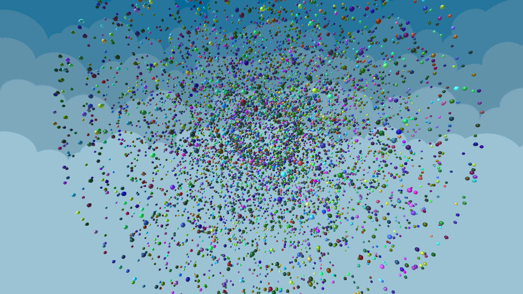

# SharedArray Demo

A Unity 2019.3 project that demonstrates the use of the [SharedArray library](https://github.com/stella3d/SharedArray).

## Scene

To run the demo, open the `SharedArray Demo` scene.

### What It Does

Arbitrary calculations for changing the position & color of mesh instances are performed, each frame. 

These are done on worker threads, in [C# jobs](https://docs.unity3d.com/Manual/JobSystem.html), using [Unity.Mathematics](https://github.com/Unity-Technologies/Unity.Mathematics) types & the [Burst compiler](https://docs.unity3d.com/Packages/com.unity.burst@1.1/manual/index.html).

After the calculations are complete for a frame, the same data / memory used in the calculation jobs is used as a normal array, as arguments to Unity methods like `Graphics.DrawMeshInstanced` to draw the updated meshes.
